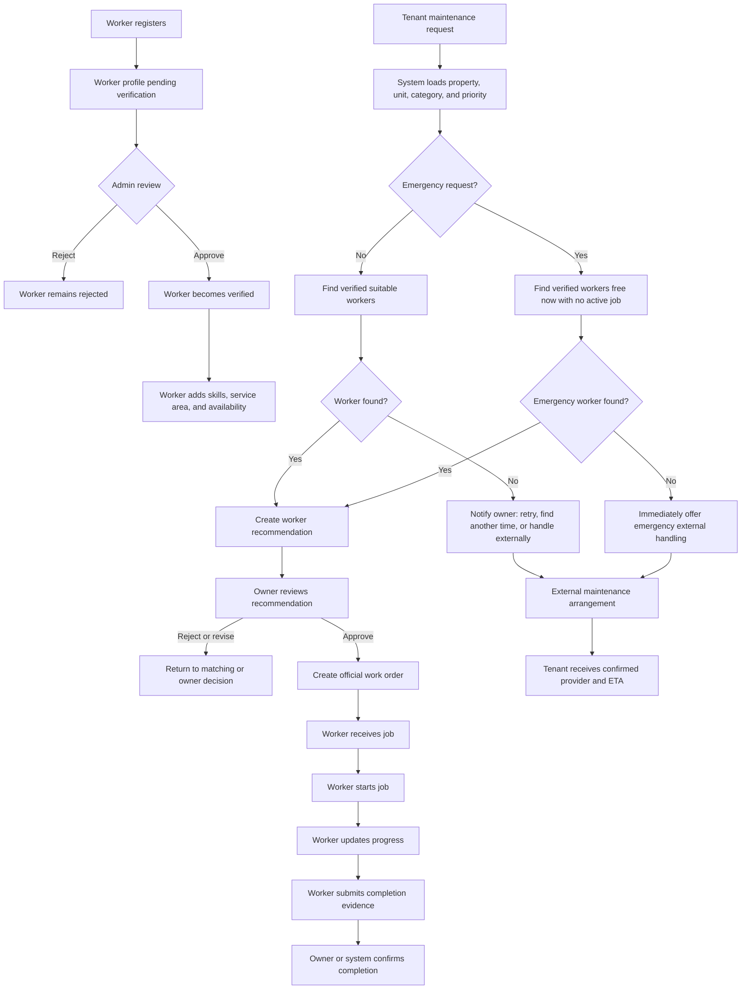

# Member 4 Worker and Work Order Workflow

## Purpose

This workflow defines the Member 4 implementation before Agent 4 is added. The
system must support worker registration, verification, availability, matching,
owner approval, work orders, completion evidence, and external maintenance
using deterministic business rules.

Agent 4 will be added later as a validation layer. It must not be required for
the basic Member 4 workflow to operate.

## Actors

| Actor | Responsibility |
| --- | --- |
| Maintenance Worker | Register, provide proof, manage skills and availability, perform approved jobs, submit progress and completion evidence |
| Site Admin | Review worker details and proof, approve or reject workers |
| Property Owner | Review a worker recommendation, approve or reject the assignment, arrange external maintenance when required |
| Tenant | Submit the maintenance request and view confirmed work-order or external-arrangement updates |
| System | Apply deterministic matching, authorization, status-transition, and conflict rules |

## Main Workflow



## Detailed Steps

### 1. Worker registration and verification

1. The worker submits personal details, mobile or email, trade or skill,
   service area, and proof documents.
2. The account is created with the `MaintenanceWorker` role but remains
   `PendingVerification`.
3. The Admin reviews the application.
4. Approval changes the worker to `Verified`; rejection records a reason.
5. Only verified workers can appear in recommendations or receive work orders.

### 2. Worker readiness

The verified worker manages:

- Skills or trades.
- Service area.
- Available or unavailable state.
- Availability windows, where scheduling uses time slots.
- Current active work orders.

The system must reject overlapping availability records and must not treat a
worker with an active conflicting job as available.

### 3. Deterministic matching

For normal maintenance, the system filters workers by:

1. Verified status.
2. Required skill.
3. Service area covering the property.
4. Availability and workload.
5. A suitable future time.

For emergency maintenance, the system filters workers by:

1. Verified status.
2. Required skill.
3. Service area covering the property.
4. `FreeNow` availability.
5. No conflicting active work order.

The emergency path must return `NO_AVAILABLE_EMERGENCY_WORKER` immediately
when no worker qualifies. It must not wait for a busy worker or automatically
reassign an active job.

### 4. Owner approval

A matching result is only a recommendation. The Property Owner is the final
human approver.

- `Approve`: creates the official internal Work Order.
- `Reject`: records the reason and returns the request for another decision.
- `RequestRevision`: asks for another time or matching attempt.

No worker should receive an official job before approval is recorded.

### 5. Work-order lifecycle

```text
Proposed
  -> Approved
  -> Assigned
  -> InProgress
  -> Completed
```

Allowed alternatives:

```text
Proposed -> Rejected
Proposed -> RevisionRequested
Assigned -> Cancelled
InProgress -> Cancelled
```

Completion requires evidence, such as notes and optional images. The request
history and work-order history must be preserved.

### 6. External maintenance

Normal no-worker handling allows the Owner to:

- Find another time.
- Retry matching.
- Handle the request externally.

Emergency no-worker handling allows only immediate external handling. It does
not offer a later internal time slot.

External providers must be stored in a dedicated
`ExternalMaintenanceArrangement` linked to the maintenance request. An
external provider must never be represented as a fake system Worker.

## Core Relationships

```text
User 1 --- 1 Worker
Worker 1 --- many WorkerSkill
Worker 1 --- many WorkerDocument
Worker 1 --- many WorkerAvailability
Worker 1 --- many WorkOrder
MaintenanceRequest 1 --- many WorkerMatchRecommendation
MaintenanceRequest 1 --- many WorkOrder
MaintenanceRequest 1 --- many ExternalMaintenanceArrangement
WorkOrder many --- 1 Worker
WorkOrder many --- 1 MaintenanceRequest
```

The maintenance request already supplies the Tenant, Tenancy, Property, and
Unit context. Member 4 consumes that context for matching and scheduling; it
does not own the Tenant or Property business rules.

## Initial API Boundary

| Endpoint | Purpose |
| --- | --- |
| `POST /api/workers/register` | Submit worker registration and proof |
| `GET /api/workers/me` | Read the current worker profile |
| `PUT /api/workers/me` | Update permitted worker details |
| `PUT /api/workers/me/availability` | Set current availability or time windows |
| `GET /api/workers` | Admin or controlled matching list with filters |
| `PUT /api/admin/workers/{id}/verification` | Approve or reject a worker |
| `GET /api/work-orders` | Role-aware work-order list |
| `GET /api/work-orders/{id}` | Work-order details |
| `PUT /api/work-orders/{id}/status` | Start, update, or complete a job |
| `POST /api/maintenance-requests/{id}/approval` | Owner approves, rejects, or requests revision |
| `POST /api/maintenance-requests/{id}/external-arrangement` | Start external handling |
| `PUT /api/external-arrangements/{id}/confirm` | Confirm provider and ETA or schedule |

## Later Agent 4 Integration

Agent 4 is inserted after a worker recommendation and before Owner approval:

```text
Agent 3 or deterministic matching
    -> WorkerMatchRecommendation
    -> Agent 4 validation
    -> ValidationResult
    -> Owner ApprovalDecision
    -> WorkOrder creation
```

Agent 4 validates the same deterministic rules already used by the Member 4
workflow. It does not create the final assignment and does not replace Owner
approval. Until Agent 4 exists, the system should use the deterministic
validator directly and keep the validation boundary explicit so the agent can
be added without redesigning WorkOrder creation.

## UI-First Implementation Strategy

Member 4 will first create the complete UI for the assigned workflows, then
implement the ASP.NET API one feature at a time and replace each mock operation
with a real request. This is acceptable provided the UI is built against
stable request/response contracts and the mock layer is temporary.

The UI phase must not invent a separate business workflow. It should use the
same statuses, roles, permissions, validation messages, and data relationships
defined in this document. The database foundation and API contract list should
be treated as the source of truth even while the UI uses mock data.

### Rules for the UI-first phase

- Use a small Member 4 mock service or local fixture data behind the same API
  service functions that will later call Axios or the ASP.NET API.
- Keep mock data IDs and field names aligned with the planned DTOs.
- Do not put business rules only in React or Flutter; the backend will repeat
  every authorization and workflow rule.
- Add loading, empty, validation, unauthorized, server-error, and success
  states to every screen before replacing the mock service.
- Mark mock actions clearly in development and remove the mock implementation
  when the real endpoint is connected.
- Do not commit passwords, database connection strings, map keys, or uploaded
  proof documents.

The recommended order is:

### Slice 0: Shared contracts and database foundation

Before building screens:

- Add `Worker`, `WorkerSkill`, `WorkerDocument`, `ServiceArea`,
  `WorkerAvailability`, `WorkOrder`, and `ExternalMaintenanceArrangement`.
- Add `WorkerMatchRecommendation`, `ValidationResult`, and `ApprovalDecision`
  as persistence-ready contracts, even if Agent 4 is not implemented yet.
- Add status enums or constants, foreign keys, indexes, timestamps, and EF Core
  migrations.
- Link `Worker` to the shared `User` identity and link `WorkOrder` to
  `MaintenanceRequest`.
- Confirm the shared database and migration process with the team before
  pushing the migration.

No user-facing screen should depend on a second database or a temporary fake
worker record.

### UI Phase 1: Complete the React Member 4 screens

Build the following screens with mock data and a replaceable service layer:

1. Public Worker Registration form.
2. Worker verification pending, approved, and rejected states.
3. Admin Worker Verification list, details, proof preview, approve, and reject.
4. Owner worker recommendation and approval card.
5. Owner work-order list and detail pages.
6. Owner normal no-worker actions.
7. Owner emergency external-handling form.

For every screen, test navigation, form validation, loading, empty results,
success, failure, and role-based visibility from the web before starting API
replacement.

### Deferred UI Phase: Flutter Worker screens

Flutter is intentionally deferred while the React web workflows and backend
contracts are completed. It remains part of the final Member 4 deliverable and
must use the same API, DTOs, statuses, identity, and business rules as the web
application. Do not create a separate mobile-only workflow.

Build the Worker Dashboard shell and navigation with mock data:

1. Home.
2. My Jobs.
3. Current Active Job.
4. Job Details and location map view.
5. Start Job, Update Progress, and Complete Job.
6. Completion evidence with notes and photo.
7. Job History.
8. Availability and Profile.
9. Emergency job indicator.

When mobile work resumes, the Flutter screens should use the same field names
and statuses as the React screens. Do not create a second Worker or WorkOrder
model for mobile.

## Current Scope: Web First

Until the React web workflow and its APIs are complete, Member 4 work is
limited to:

- React Worker registration and verification.
- React Owner recommendation and approval.
- React Work Orders list and details.
- React normal and emergency external handling.
- React worker profile, skills, service area, and availability screens.
- ASP.NET APIs and PostgreSQL persistence for each completed web slice.
- Maps integration required by the web service-area and location workflows.

Flutter screens are not a blocker for completing and testing these web slices.
The mobile phase begins only after the web APIs, authorization rules, status
transitions, and DTOs are stable.

### API Phase 1: Replace Worker registration mocks

**Immediately connect the backend:**

- `POST /api/workers/register`
- `GET /api/workers`
- `GET /api/workers/{id}`
- `PUT /api/admin/workers/{id}/verification`

**Business checks:**

- Public registration creates a `PendingVerification` worker.
- Duplicate email or mobile is rejected.
- Only Admin can approve or reject.
- Rejection requires a reason.
- Unverified workers cannot be matched or assigned.

After the endpoints pass backend tests, replace only the registration and
verification mock functions. Keep the UI unchanged unless the DTO contract
needs a documented correction.

### API Phase 2: Replace profile, skills, service area, and Maps mocks

**Immediately connect the backend:**

- `GET /api/workers/me`
- `PUT /api/workers/me`
- Worker skill and service-area update endpoints.
- Backend map/geocoding service boundary with environment-based configuration.

**Business checks:**

- Only the authenticated worker can update their own profile.
- Only verified skills can be used for matching if the team requires skill
  review.
- Map failures, invalid locations, rate limits, and timeouts return safe errors.
- Coordinates and service-area data are not exposed beyond what matching and
  navigation require.

### API Phase 3: Replace availability mocks

**Immediately connect the backend:**

- `GET /api/workers/me/availability`
- `PUT /api/workers/me/availability`
- Optional availability-slot create/update/delete endpoints if the UI needs
  separate records.

**Business checks:**

- End time must be after start time.
- Overlapping availability slots are rejected.
- An active conflicting Work Order makes a worker unavailable.
- `Free Now` means currently available and without an active conflicting job.

### API Phase 4: Replace recommendation and approval mocks

**Immediately connect the backend:**

- Deterministic matching service and recommendation endpoint.
- `GET /api/maintenance-requests/{id}/recommendation`
- `POST /api/maintenance-requests/{id}/approval`

**Business checks:**

- A recommendation is not an assignment.
- Only the Property Owner of the related property can approve.
- Only `Approve` creates a Work Order, inside a transaction.
- Reject and RevisionRequested preserve an auditable decision.

Agent 4 is intentionally not required for this slice. Use the deterministic
validator and keep its output compatible with the later `ValidationResult`
contract.

### API Phase 5: Replace work-order execution mocks

**Immediately connect the backend:**

- `GET /api/work-orders`
- `GET /api/work-orders/{id}`
- `PUT /api/work-orders/{id}/status`
- Completion evidence upload endpoint or multipart status request.

**Business checks:**

- Workers see only their assigned jobs.
- Owners see jobs for properties they own.
- Status transitions are enforced server-side.
- Completion requires the required notes and evidence.
- Every status change preserves history.

### API Phase 6: Replace external-handling mocks

**Immediately connect the backend:**

- `POST /api/maintenance-requests/{id}/external-arrangement`
- `PUT /api/external-arrangements/{id}`
- `PUT /api/external-arrangements/{id}/confirm`

**Business checks:**

- Normal requests support retry, later scheduling, or external handling.
- Emergency requests do not offer Find Another Time.
- No available emergency worker routes immediately to external handling.
- External providers are stored only in `ExternalMaintenanceArrangement`.
- No fake Worker is created for an external provider.

### Final Phase: Agent 4 integration

After the other members provide Agent 2 and Agent 3 outputs:

1. Add allow-listed Agent 4 tools.
2. Validate Agent 2 analysis and Agent 3 recommendations against the existing
   deterministic rules.
3. Persist `ValidationResult` with `PASS`, `FAIL`, or
   `REVISION_REQUIRED`.
4. Add bounded retries, schema validation, timeout handling, prompt-injection
   tests, and safe failure.
5. Display the Agent 4 result in the Owner approval card.

Agent 4 remains a guard. It never performs the final Owner approval and never
creates a Work Order by itself.

## API Replacement Checklist

For each mock service function:

1. Define or confirm its request and response DTO.
2. Implement the controller, service, authorization, and persistence.
3. Add or apply the EF Core migration if the schema changes.
4. Add backend tests for success, validation, authorization, and failure.
5. Test the endpoint in Swagger or an API client.
6. Replace the mock service call with the real API call.
7. Test the complete web flow using the running API and shared PostgreSQL
  database.
8. Remove the completed mock path and keep the UI states.

Do not move to the next API phase until the current phase works through the
web against PostgreSQL.

## Cross-Cutting Completion Checklist

For every UI/API slice, verify:

- React calls the ASP.NET API rather than using mock data. Flutter will follow
  the same contract when the deferred mobile phase begins.
- DTOs are used instead of exposing EF entities.
- Loading, empty, validation, unauthorized, server-error, and success states
  are implemented.
- JWT/RBAC and ownership checks are tested.
- PostgreSQL changes are covered by an EF migration.
- API and service tests cover the business-specific rule.
- The UI uses the shared status vocabulary.
- The feature is committed on the Member 4 branch with a focused commit.


## Deferred Mobile Exit Criteria

Start the Flutter phase after all of the following are true:

- React web screens use real APIs rather than mock services.
- Worker, availability, approval, work-order, and external-arrangement APIs
  pass their backend tests.
- PostgreSQL migrations are applied to the shared development database.
- JWT/RBAC and ownership checks are verified through the web.
- API DTOs and status transitions are documented and stable.


## ADR and Delivery Work

Alongside the vertical slices, Member 4 owns:

- Cloud deployment platform ADR for the ASP.NET API, PostgreSQL, React, and
  Agent service.
- Maps integration documentation, environment configuration, privacy rules,
  and failure handling.
- Flutter Worker Dashboard shell conventions.
- Worker, availability, work-order, external-maintenance, Maps, and Agent 4
  test evidence.
